## 导师
## 一、导师流程图

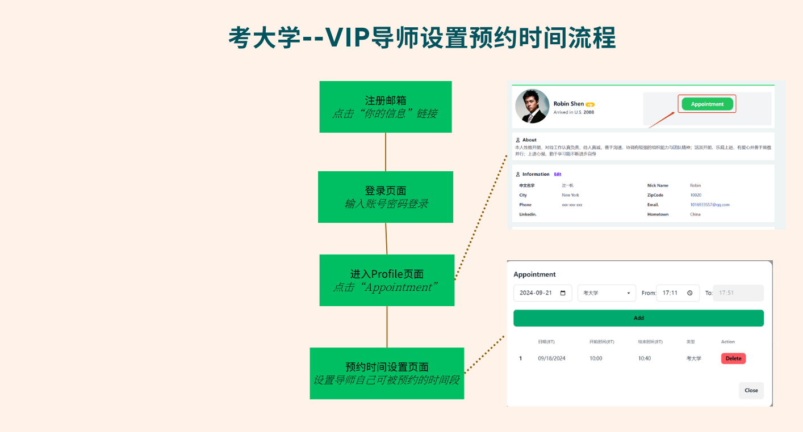

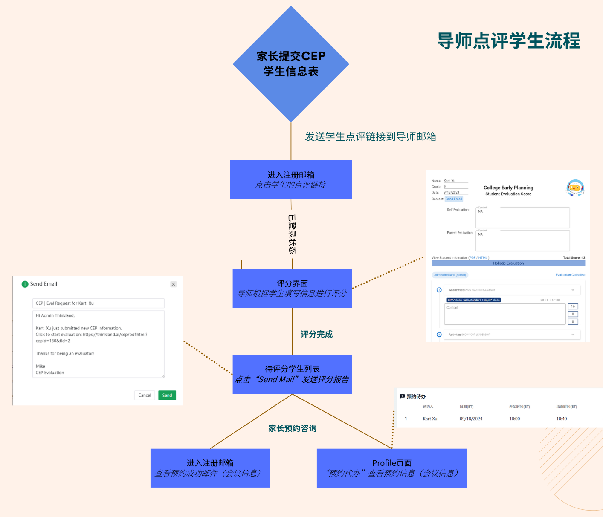

## 二、注册导师

进入LongHub官网：[https://longhub.org/](https://longhub.org/)

点击页面的`为了下一代 加入我们`按钮

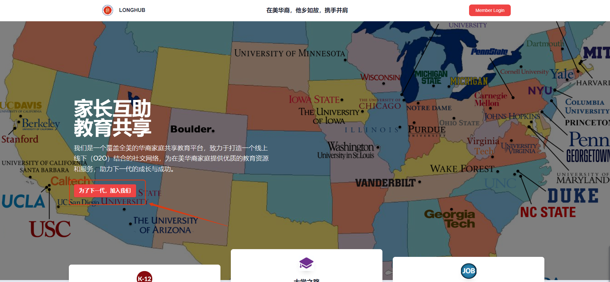

### 1. 填写注册信息

填写注册表单，填写完成后会有注册信息发送到邮箱（注册填写的邮箱）

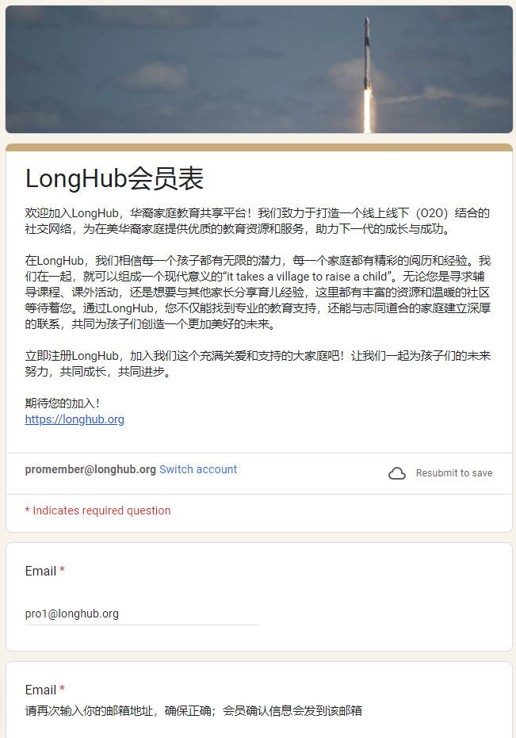

申请者选择填写成为我们的成为专家会员

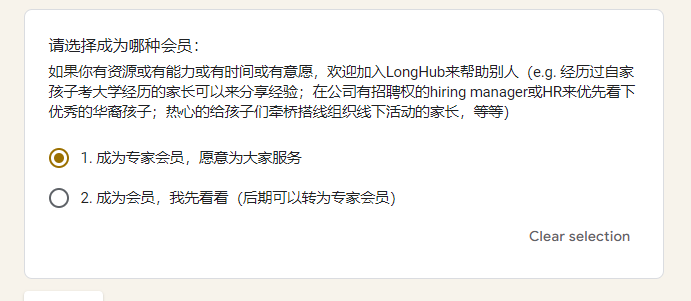

填写能够提供的服务领域以及服务项目

### 2.获取注册信息

登录注册填写的邮箱，在收件箱可以获取我们的账号信息以及Profile链接

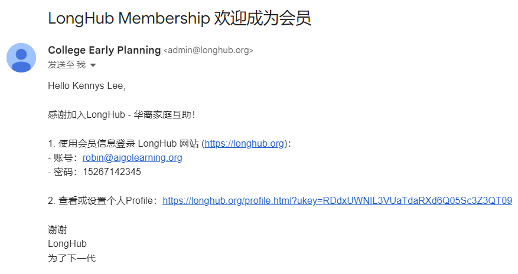

### 3.审核

注册成为专家会员之后，会由LongHub管理员进行审核，审核通过后即可成为导师会员账号

## 三、Profile

点击注册邮件中的`个人Profile`链接，即可无需登录进入Profile页面

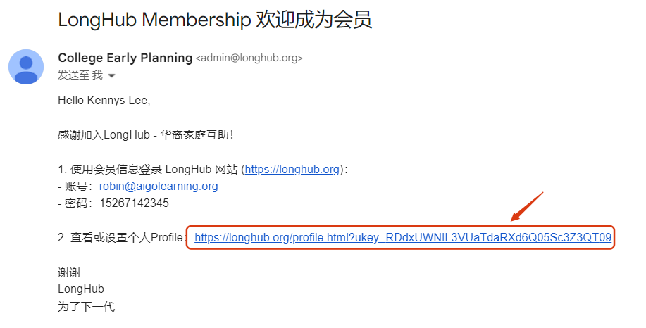

### 1. 上传/修改头像

点击`Upload picture`或者`change picture`,即可上传/修改图片或者图片链接

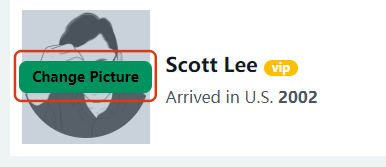
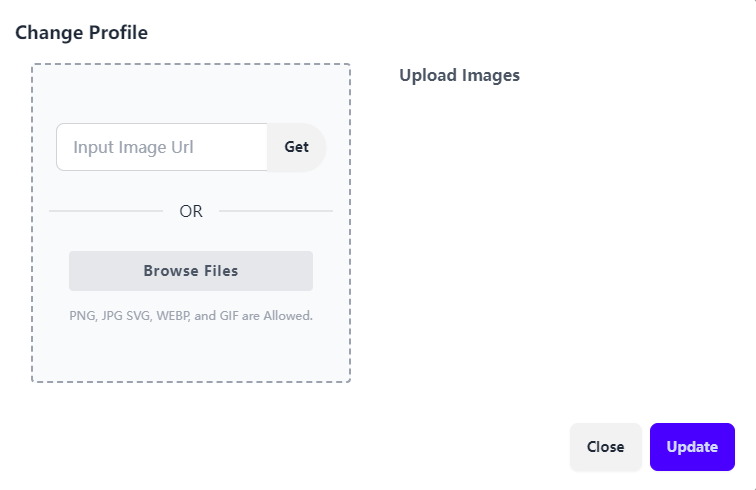

### 2.设置微信二维码

点击`Wechat`,即可上传/修改微信二维码

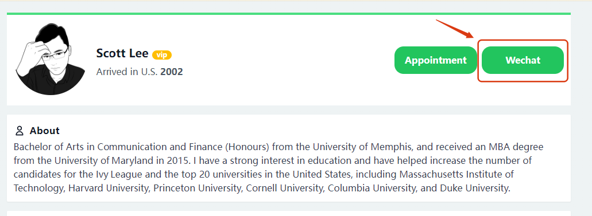
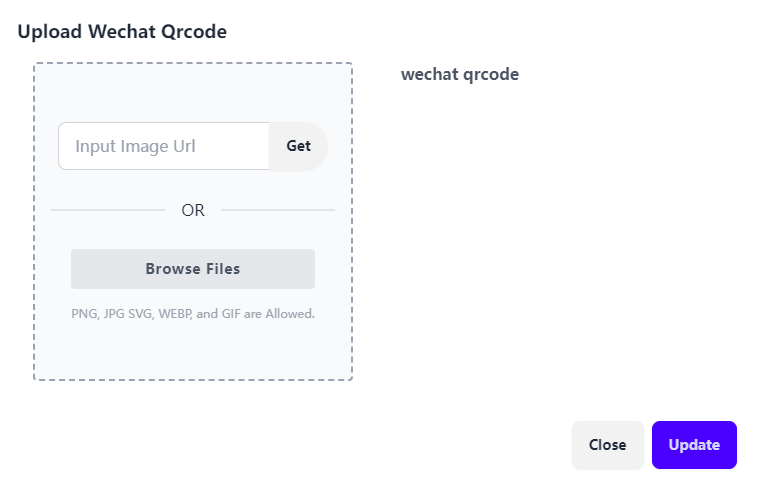

### 3.修改个人信息

点击个人信息的`Edit`,即可修改个人信息

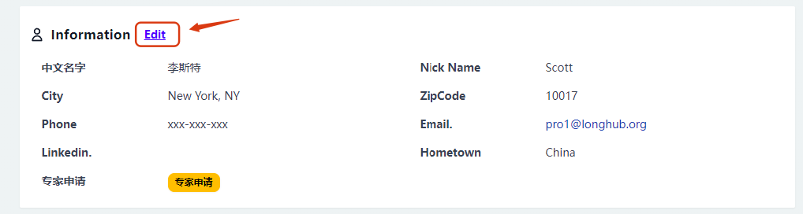

### 4.修改考大学可服务项目

点击考大学的`Edit`,即可修改考大学可服务项目

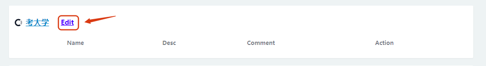
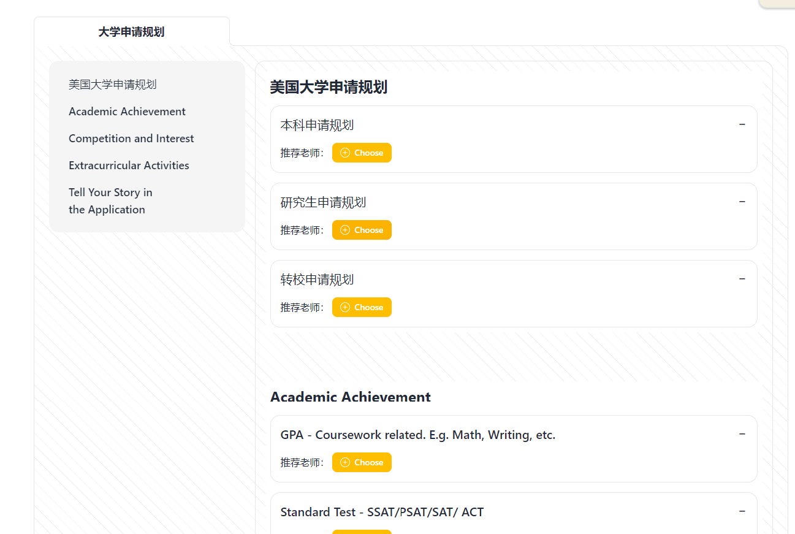

### 5.设置可预约时间段
点击`Appointment`，设置可预约、可预约项目以及可预约时间，点击`Add`即可生成可预约时间段

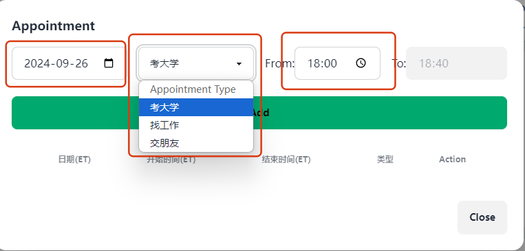
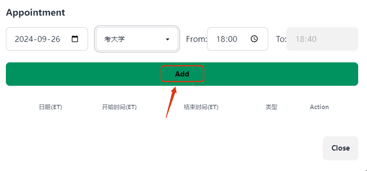

## 四、考大学

### 1. 点评学生

当有学生提交测评信息表后，系统会自动发送测评邮件到导师邮箱

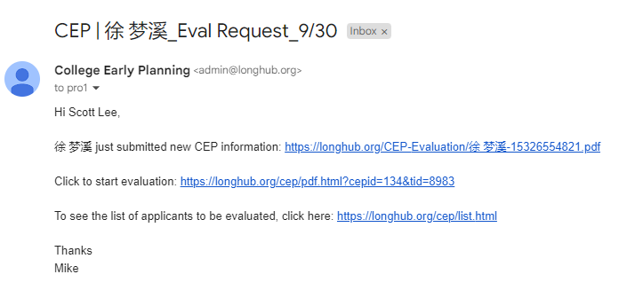

点击测评邮件中的evaluation链接，将进入点评页面

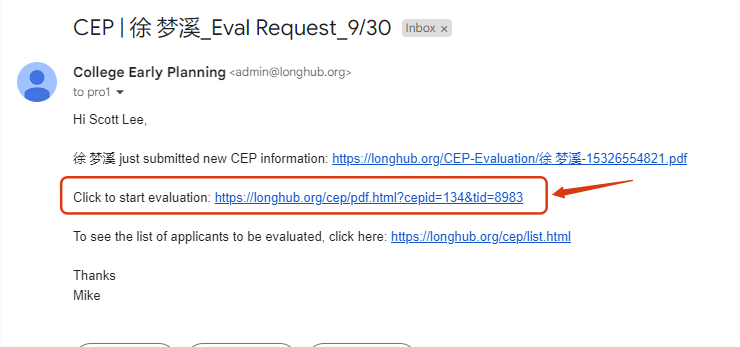
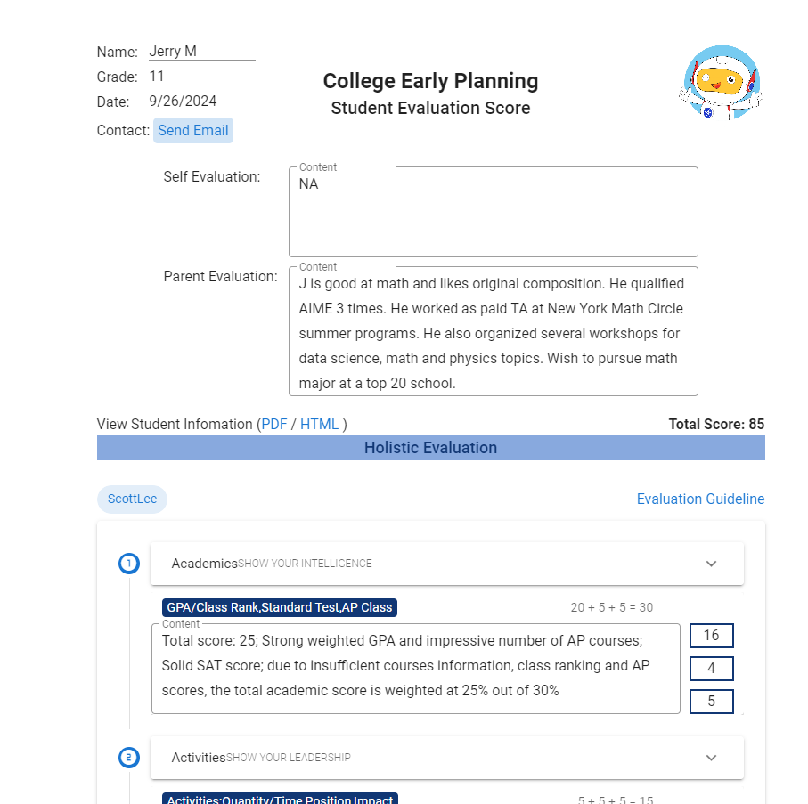

根据学生提交的信息，给学生做点评以及打分

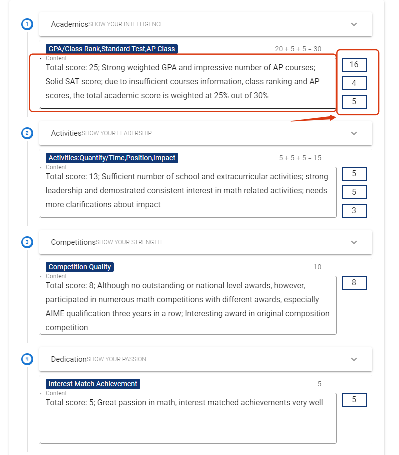

点评完成之后，点击`SUBMIT`提交报告

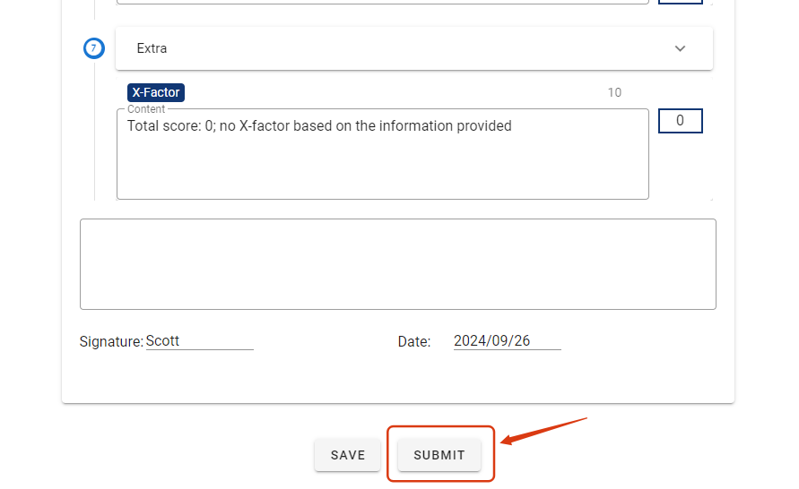

### 2. AI点评
点评界面新增了`AI Evaluation`的功能，点击之后AI会根据学生的信息，自动给出点评和打分，导师可以在AI的点评基础上做调整。

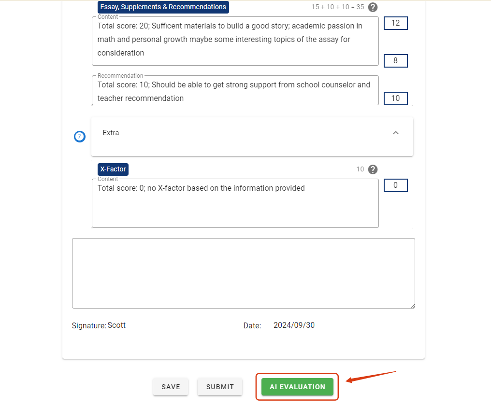

### 3. 报告审核/发送报告
导师点评学生后，点击提交即可发送通知给管理员，管理员审核通过后提交，即可发送学生点评报告邮件给学生。

## 五、预约提醒

### 1. 预约邮件提醒

当有学生预约自己的时候，会有个邮件提醒（包含了预约时间段以及会议信息）

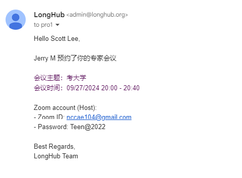

### 2. 预约代办

当有学生预约自己的时候，同时会显示在Profile的预约待办列表（包含了预约时间段以及会议信息）

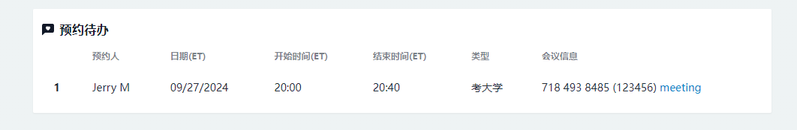

