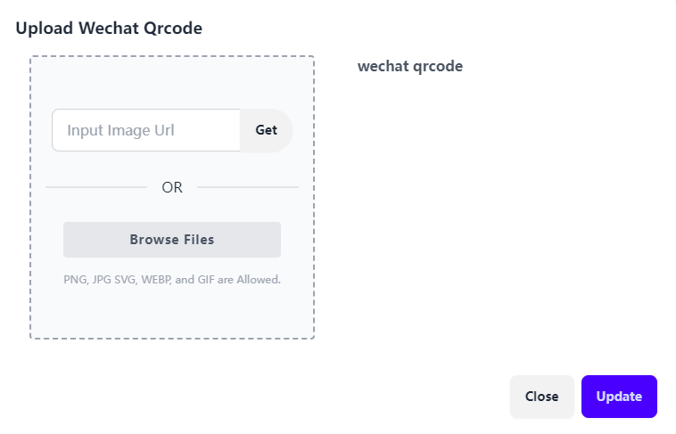

## 普通会员（家长）

## 一、注册会员

进入LongHub官网：[https://longhub.org/](https://longhub.org/)

点击页面的`为了下一代 加入我们`按钮

### 1. 填写注册信息

填写注册表单，填写完成后会有注册信息发送到邮箱（注册填写的邮箱）

申请者选择填写成为我们的成为会员

### 2.获取注册信息

登录注册填写的邮箱，在收件箱可以获取我们的账号信息以及Profile链接

## 二、Profile

点击注册邮件中的`个人Profile`链接，即可无需登录进入Profile页面

### 1. 上传/修改头像

点击`Upload picture`或者`change picture`,即可上传/修改图片或者图片链接

### 2.设置微信二维码

点击`Wechat`,即可上传/修改微信二维码

### 3.修改个人信息

点击个人信息的`Edit`,即可修改个人信息

## 三、考大学

点击Profile页面的`考大学`，

### 1. 添加孩子

点击`Add Child`,添加自己的孩子姓名,可以支持添加多个孩子

### 2. 提交学生测评

首先选择你要提交测评的孩子

然后点击`Submit Your Information`，然后根据孩子的信息填写CEP学生信息表单

提交完成后学生信息表Student Information Form.pdf 会发送到您测评时填写的邮箱。

同时也可以在考大学网页上点击`View Your Report Card`可以查看

学生提交完成后会将学生信息表发送给多名LongHub大学申请的专家们，做评估打分

### 2. 修改/补充学生信息

方法一、填写好学生信息后，学生信息表Student Information Form.pdf 会发送到您测评时填写的邮箱，邮件中有个链接可以补充修改学生信息

方法二、专家评估打分的时候，如需家长补充学生信息，
比如

-- Grading 要提交transcript – 看所选课程的完整性和难度（e.g., Honor）

-- Competition 要提交奖状 – 看含金量，哪个level（state，national，int’l）

-- Activities 每一项要详细信息 – 持续性（多久，每年？）, leadership（职务）

专家可以发送一封邮件要求学生补全信息，该邮件当中带有一个链接可以补充修改学生信息

方法三、再次点击考大学网页上点击`Submit Your Information`，也可进入修改补全信息

### 3. 查看导师评估

导师完成评估后，经过管理员审核通过并提交之后，会有一封邮件发送到学生邮箱，带有导师的评估报告链接

同时也可以在考大学网页上点击`查看你的评分`查看导师评估

## 四、预约专家

### 1. 预约专家时间

导师完成评估后，会有一封邮件发送到学生邮箱，带有导师的Profile链接,点击链接进入专家的Profile页面，点击`Appointment`，即可选择该专家的可预约时间段

预约的导师可以是给您孩子做了评估的专家，也可以在我们的考大学网页上的专家名单中选取其他导师来做咨询

### 2. 预约邮件提醒

当预约专家的时间后，会有个邮件提醒（包含了预约时间段以及会议信息）

### 2. 我的预约

当专家预约完成后，同时会显示在Profile的我的预约列表（包含了预约时间段以及会议信息）

