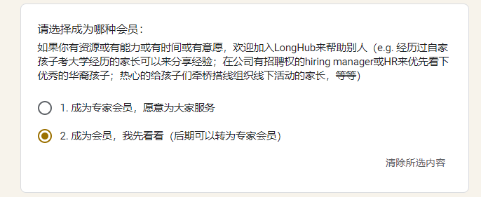
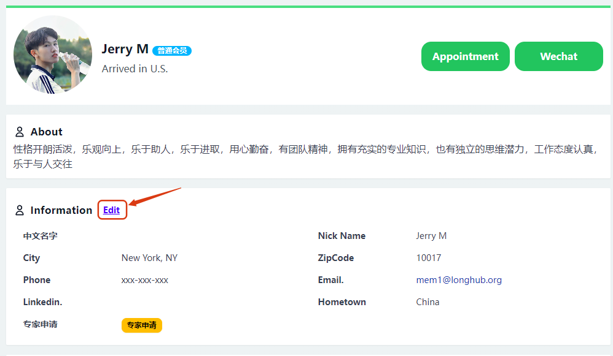
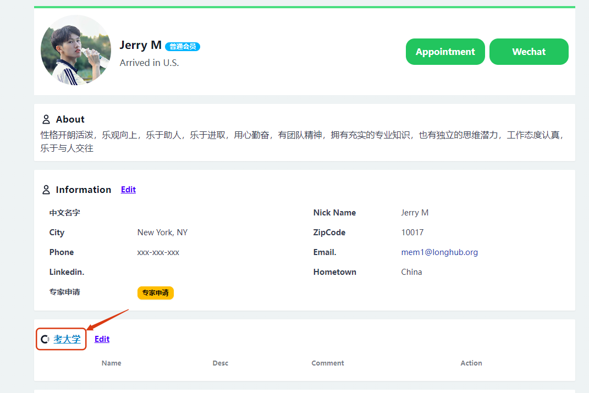
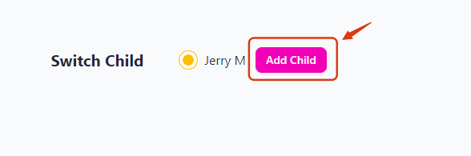
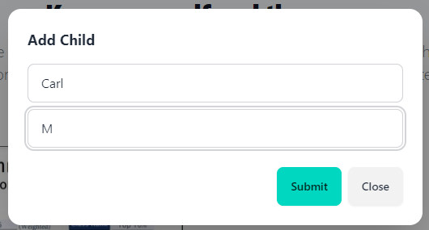
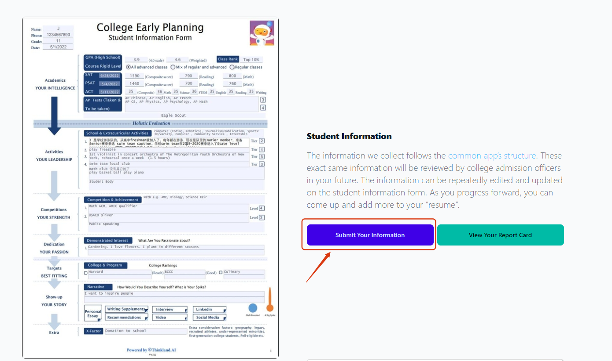
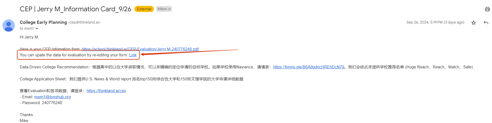
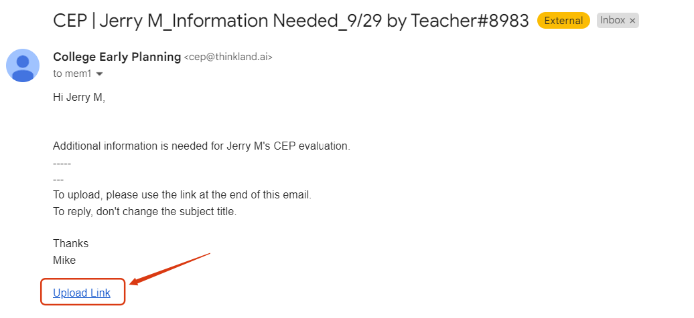
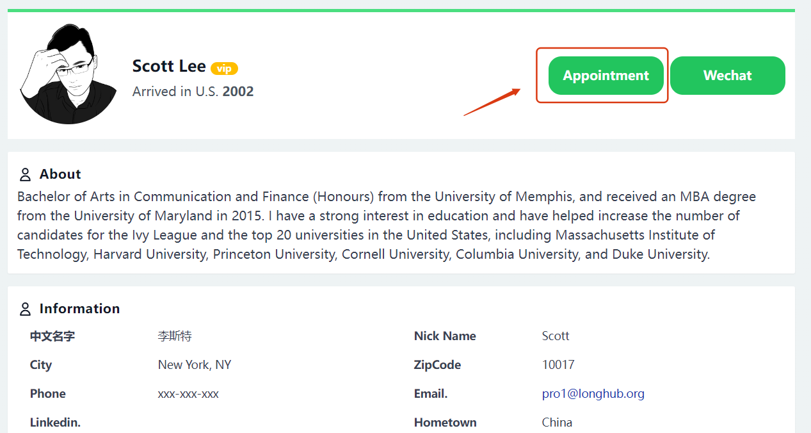
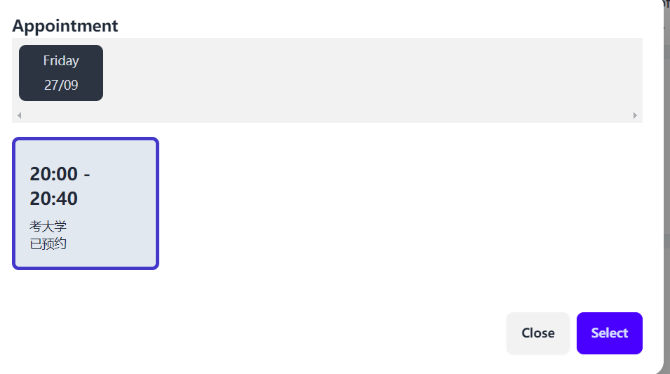

## Member（Parents）

## Ⅰ、Register as a Member

Visit the LongHub official website：[https://longhub.org/](https://longhub.org/)

Click the 'For the Next Generation, Join Us' button on the page.

### 1. Fill in the registration information

Fill out the registration form, and after completing it, registration information will be sent to the email (the one you provided during registration).

Applicants can choose to register as our member.

### 2.Obtain registration information

Log in to the email you used for registration, and in the inbox, you can find our account information and the Profile link

## 二、Profile

Click the `Personal Profile` link in the registration email to access the Profile page without logging in.

### 1. Upload/Change Profile Picture

Click `Upload Picture` or `Change Picture` to upload or modify the image or image link.

### 2.Set up WeChat QR code

Click `WeChat` to upload or change the WeChat QR code.

### 3.Edit personal information

Click `Edit` in the personal information section to modify your personal information.

## Ⅲ、College Entrance

Click on `College Entrance` on the Profile page.

### 1. Add Child

Click `Add Child` to enter your child's name. You can add multiple children.

### 2. Submit the Student Information Form

First, select the child for whom you want to submit the evaluation.

Then click `Submit Your Information` and fill out the CEP Student Information Form based on the child's information.

Once submitted, the Student Information Form.pdf will be sent to the email you provided during the evaluation.

You can also click `View Your Report Card` on the college entrance webpage to view it.

After the student submits the form, the Student Information Form will be sent to multiple LongHub college application experts for evaluation and scoring.

### 2. Edit/Add Student Information Form

Method 1: After filling out the student information, the Student Information Form.pdf will be sent to the email you provided during the evaluation. The email contains a link that allows you to add or edit the student information.

Method 2: During the expert evaluation and scoring process, if parents need to provide additional student information, such as:

-- Grading requires submitting the transcript – to assess course completeness and difficulty (e.g., Honors)

-- Competition requires submitting certificates – to evaluate the significance and level (state, national, international)

-- Activities need detailed information for each – duration (how long, yearly?), leadership (position)

The Professional member can send an email requesting the student to complete the information. This email will include a link for adding or editing the student information.

Method 3: You can also click `Submit Your Information` again on the college entrance webpage to modify and complete the information.

### 3. View Professional member Evaluation

After the Professional member completes the evaluation and it is approved and submitted by the admin, an email will be sent to the student's inbox with a link to the Professional member's evaluation report.

You can also click `View Your Score` on the college entrance webpage to see the Professional member's evaluation.

## Ⅳ、Book a Professional member Consultation

### 1. Schedule a Professional member with an Expert.

After the Professional member completes the evaluation, an email will be sent to the student's inbox containing the Professional member's Profile link. By clicking the link, you can access the Professional member's Profile page. Click 'Appointment' to select the available time slots for that Professional member.

The Professional member you book can be the Professional member who evaluated your child, or you can select another Professional member from the list of Professional members on our college entrance webpage for consultation.

### 2. Appointment Email Reminder

After scheduling an appointment with the Professional member, you will receive an email reminder (including the appointment time slots and meeting information).

### 2. My Appointments

Once the Professional member appointment is completed, it will also appear in the 'My Appointments' list on your Profile (including the appointment time slots and meeting information).

