## Professional member

## Ⅰ、Professional member Workflow Diagram

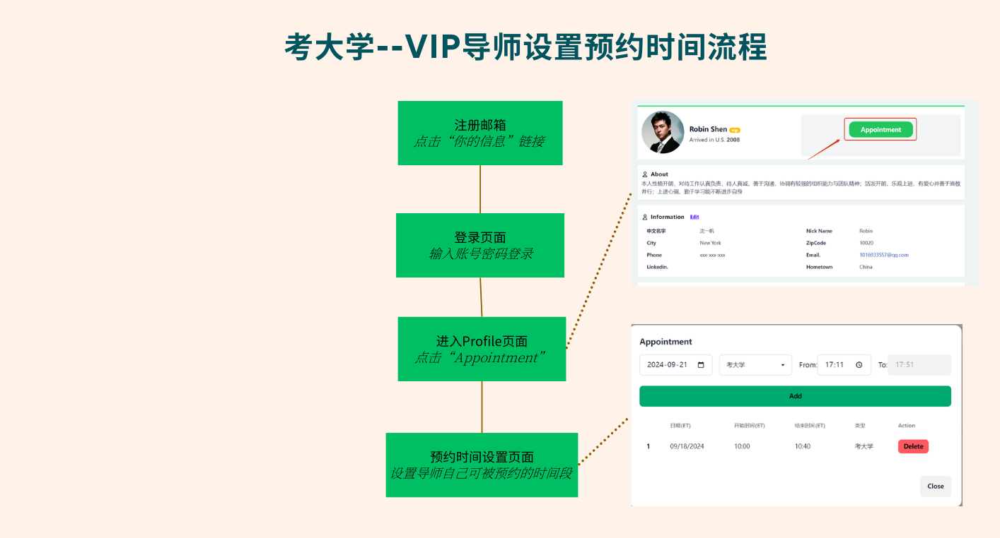

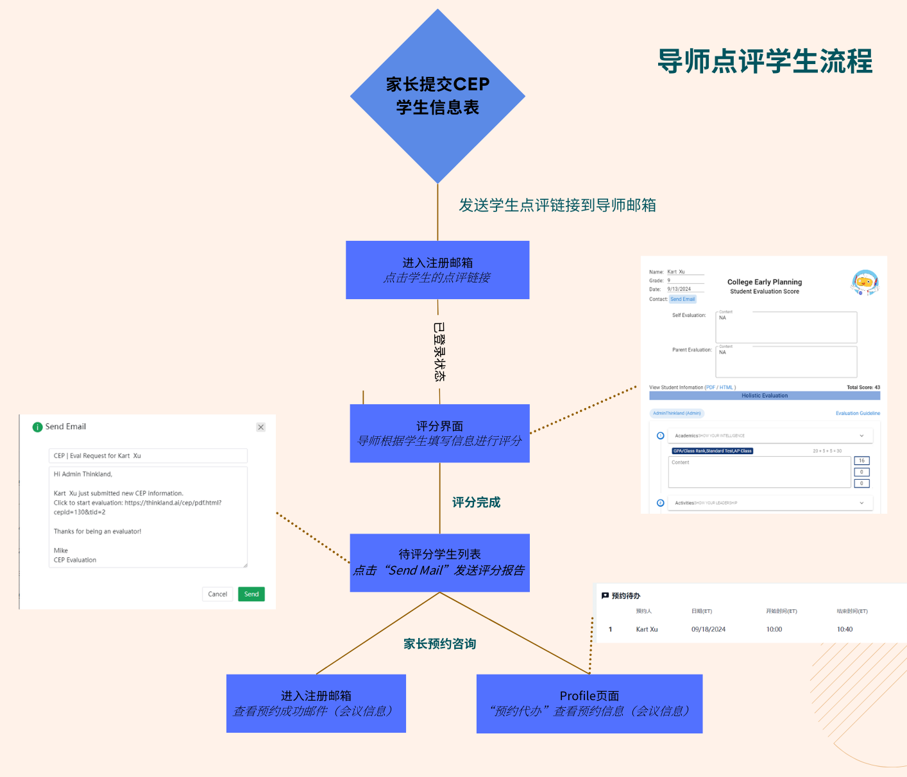

## Ⅱ、Registered Professional member

Visit the LongHub official website：[https://longhub.org/](https://longhub.org/)

Click the `For the Next Generation, Join Us` button on the page.

### 1. Fill in the registration information

Fill out the registration form, and after completing it, registration details will be sent to the email (the one you provided during registration).

Applicants can choose to register as our Professional member.

Fill in the service areas and service offerings you can provide.

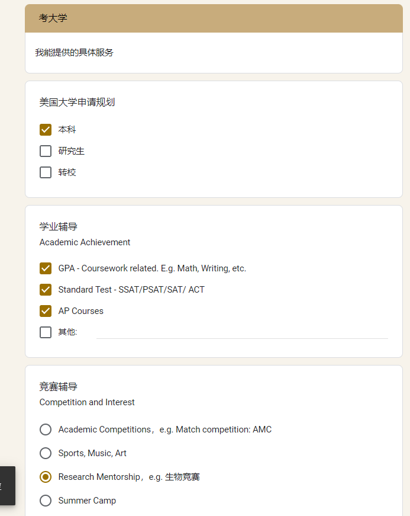

### 2.Obtain registration information

Log in to the email you used for registration, and in the inbox, you can find our account details and the Profile link.

### 3.Admin Review

After registering as a Professional member, the LongHub admin will conduct a review. Once approved, you will become a mentor member account.

## Ⅲ、Profile

Click the `Personal Profile` link in the registration email to access the Profile page without logging in.

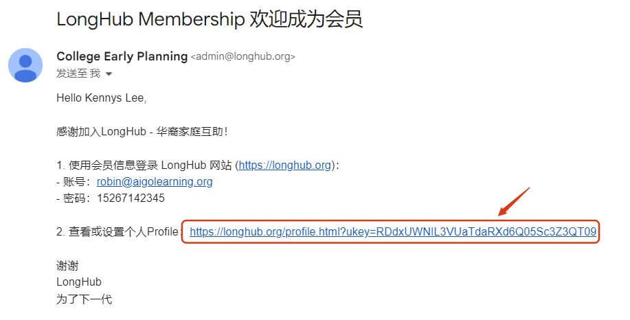

### 1. Upload/Change Profile Picture

Click `Upload Picture` or `Change Picture` to upload or modify the image or image link.

### 2.Set up WeChat QR code

Click `WeChat` to upload or change the WeChat QR code

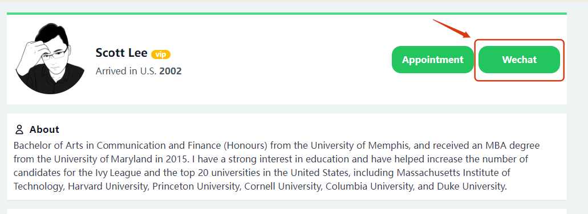

### 3.Edit personal information

Click `Edit` in the personal information section to modify your personal information.

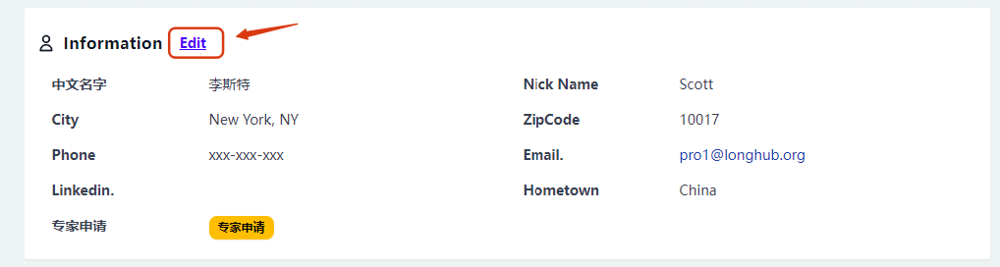

### 4.Edit college entrance service offerings

Click `Edit` in the college entrance section to modify the available service offerings

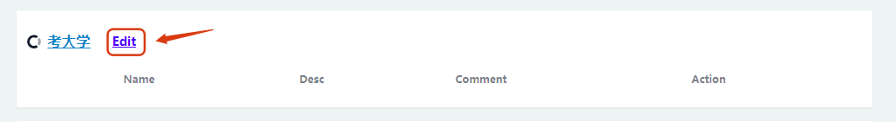
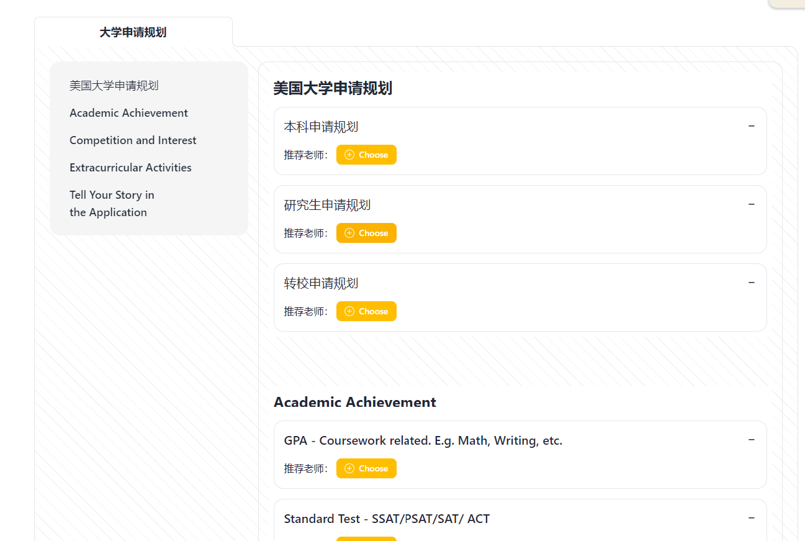

### 5.Set available time slots for appointments

Click `Appointment` to set the availability, services that can be booked, and available times. Click 'Add' to create the appointment slots.

## Ⅳ、College Entrance

### 1. Review students

When a student submits the evaluation form, the system will automatically send the evaluation email to the mentor's inbox.

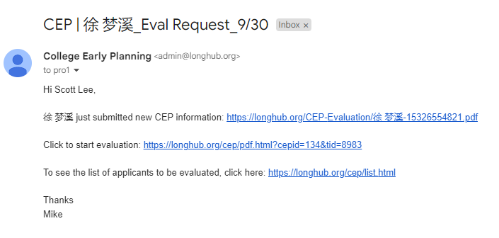

Click the evaluation link in the evaluation email to access the feedback page.

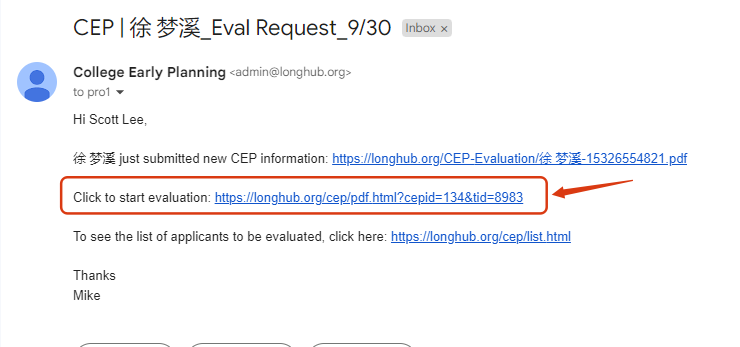

Provide feedback and a score for the student based on the information submitted by the student.

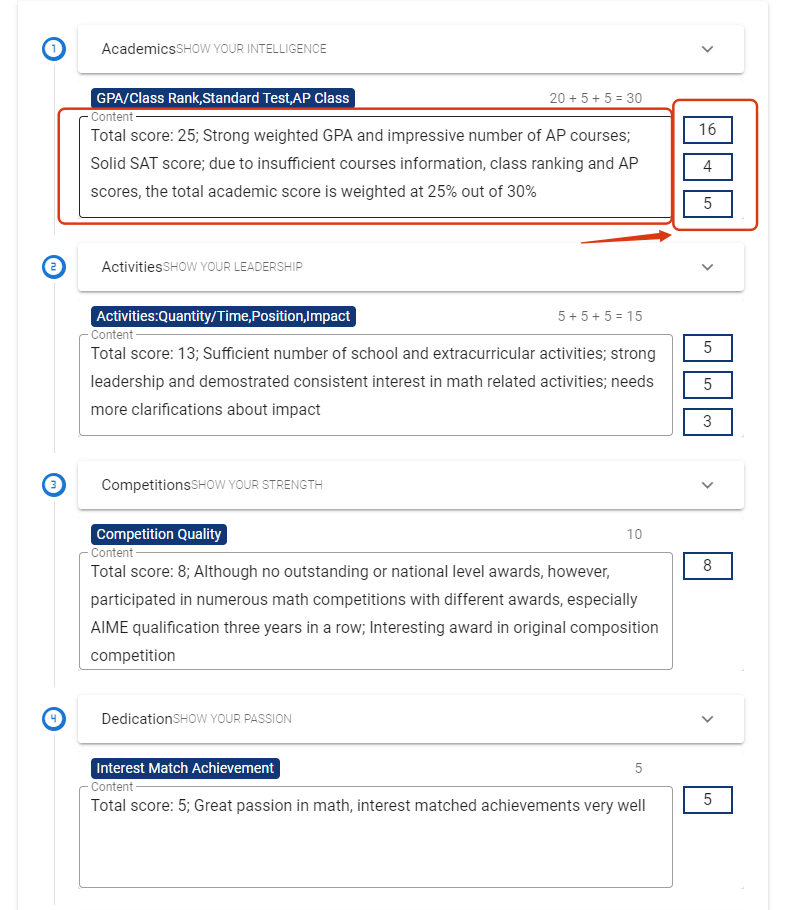

After completing the feedback, click `SUBMIT` to submit the report.

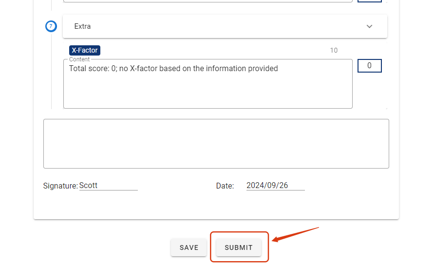

### 2. AI Review

The feedback interface has added the `AI Evaluation` feature. After clicking it, the AI will automatically provide feedback and a score based on the student's information. The mentor can adjust the feedback given by the AI as needed.

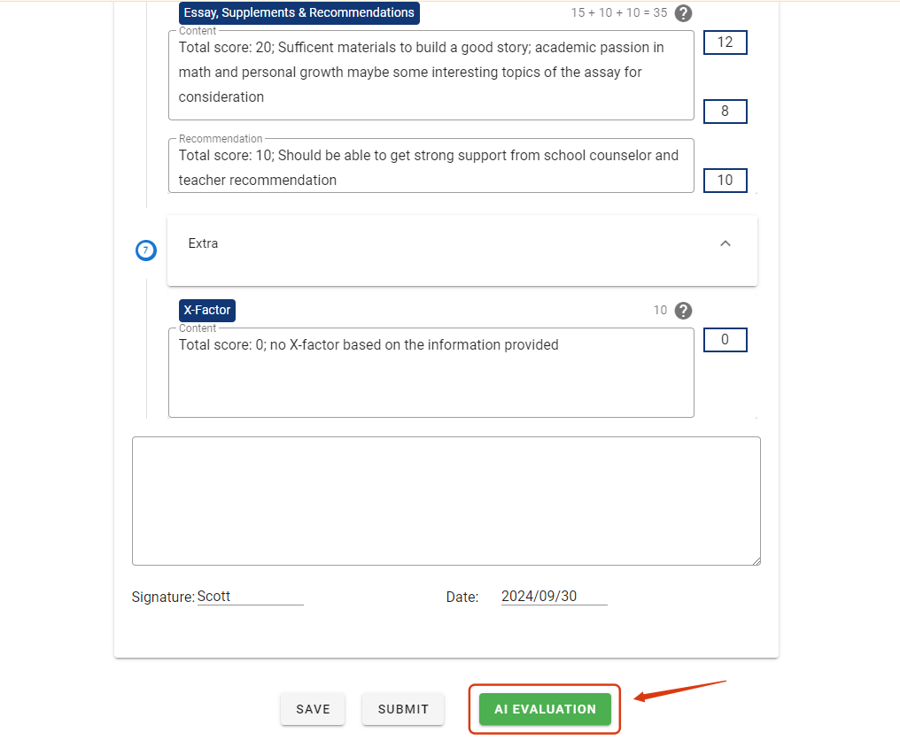

### 3. Report Review/Send Report

After the mentor provides feedback on the student, clicking submit will notify the admin. Once the admin approves and submits, the student feedback report will be emailed to the student.

## Ⅴ、Appointment Reminder

### 1. Appointment Email Reminder

When a student books an appointment with you, you will receive an email reminder (including the appointment time slots and meeting information).

### 2. Appointment Agency

When a student books an appointment with you, it will also appear in the appointment to-do list in your Profile (including the appointment time slots and meeting information).

